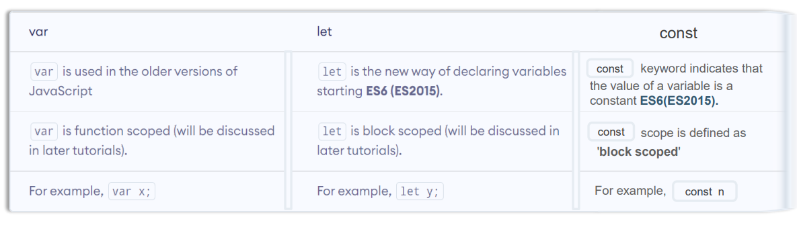
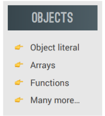
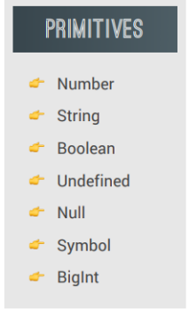
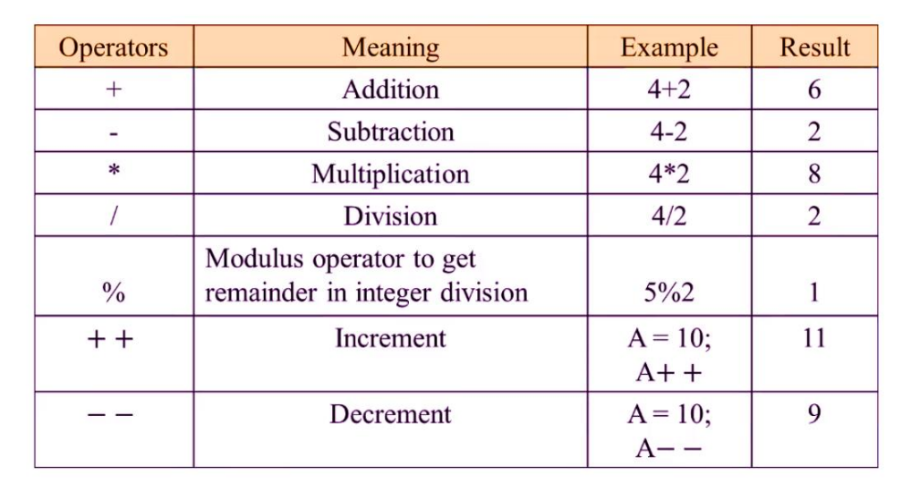
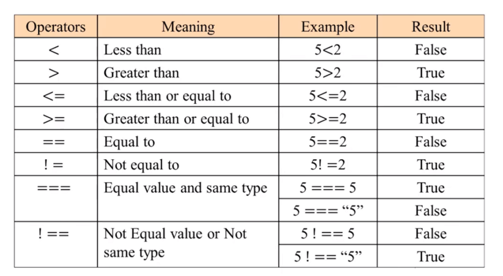

## JavaScript in yake az zaboni barnoma sozi meboshad
## JavaScript aval baroi interaktivi vebsaytho , animiat siya va khayra istifoda meshud va imruzho JavaScript da sohahoi digar, baroi server ,  barnomai telefoni  va khayra isti foda meshavad.
##  dar solhoi 1995 Brendan  Eich 1-kumin versiyai JavaScriptro ba davomi 10 hurz mesozad va nomashror Mocha memond lekin mocha dar on davra bisyor khosiathoi JavaScripti hozira ro dosht 
##  ***va dar soli 1996 nomi Mocha ba LiveScript va baЪd ba JavaScript mesheoyad Brendan  Eich baroi on nomashro javacript memonadki tahyagoni  Javaro  jalb kunad AMMO JAVASCRIT YAGON ETIBOTE BA JAVA NODORAD***
## Maicrosoft  IE  ro sar karda JavaScriptro az  Natscape kapirvat karda va nomashro jScript menomad 
## ***Baroi standartizatsuyai zabon yak ECMA ECMASript 1 (ES1) -ro barovardand ki avalin afichalniy standart baroi JavaScript meboshad (ECMASript standart ast , JavaScript zabon baroi praktika)***
## ES6/ES2015 (ECMAScript 6 2015) barovardand va buzurg tarin zabon .
##  Mo metavonem JavaScriptro bo chand tarz istifoda barem                                 1.Istifoda bo kansoli web Sayt  2. bo Node.js 3. bo sokhtani web sayti khudamon
## dar barnomasozi baroi vereybl yak kantener baroi khranit kadani daniyo istofoda burda meshavad
## ***dar barnoma sozi du namudi vereybl mav jud ast 1;var 2;let mo hardi onhoro istifoda burda metonem ommo var az let farq mekunad***

##  var in vereybli ustarefshiyay ki bisor jizora khato nishon meta 
## let in vereybli navest ki dar versiyai ES6/ES2015 (ECMAScript 6 2015) barovarda shuda ast
## bo hamroji let dar versiyai ES6/ES2015 (ECMAScript 6 2015) const barovardand farkiyati kons ay let dar on ast ki letro mo metavonem chand bor znacheniyasho istifoda barem  foda barem  connstro fakat yak bor

## mo du namud znacheniya dorem
## 1;objectiv znacheniyhoi objectiv inhoyand 
## 2;Primitive znacheniya hoi primitivinhoyand 
## nambero mo baroi rakam navisi istifoda mebarem
## string  baroi yagon text istifoda mebarem
## boolean baroi true , false istifoda mebarem
## Undefined misol ne khonaca ne kimat
## null  misol khonacha dorad kimat ne 
## sumvol baroi yagon namud sinvl navistan 
## baroi rakamhoi ay 16 ziyod 

